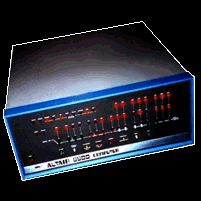

# RP6502-Fool-on-the-Hill
A tribute to [the first great microcomputer hack](https://www.digibarn.com/collections/weirdstuff/altair-sheetmusic/index.html)!

On April 16, 1975, Homebrew Computer Club member Steve Dompier used an Altair to play the Beatle's ['Fool in the Hill'](https://www.digibarn.com/collections/audio/digibarn-radio/altair-music-erik-klein/foolonthehill.wav) via EM interference on an AM radio.

I thought it fitting that my first song for the RP6502 to be 'Fool on the Hill' as well. Enjoy!

